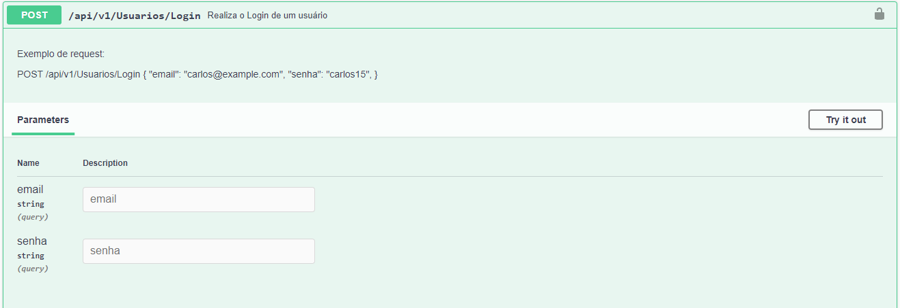
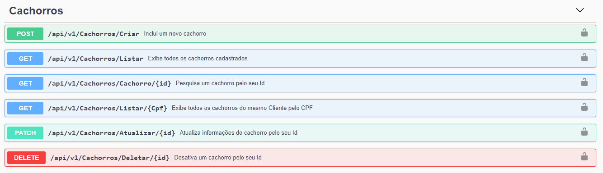
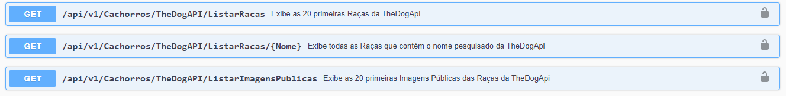
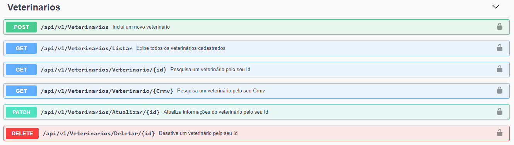
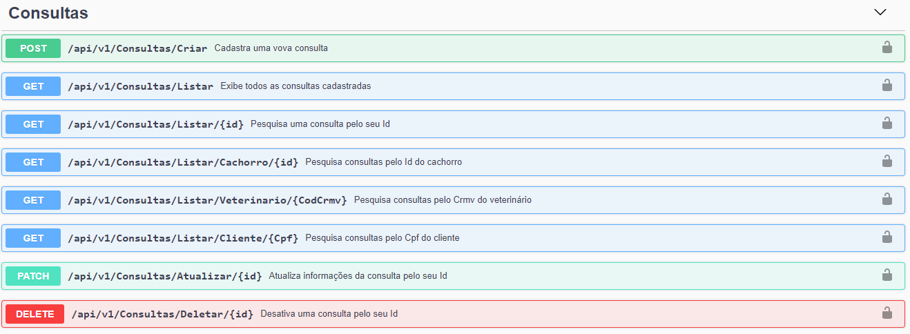
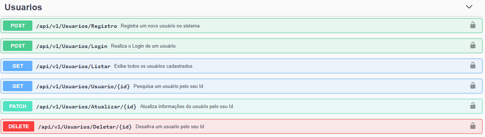

<h1 align="center">GFT - Programa Starter #4 🚀</h1>


<hr>

<h1 align="center">Desafio API</h1>
<h4 align="center">Projeto com desafios focados no desenvolvimento de API. Programa Starter, GFT Brasil.</h1>

# 🏁​ Desafio

- [x] [**End Points para sistema de atendimento veterinério 🐶**](https://git.gft.com/ardl/desafioapi/-/blob/main/Images/Desafio%20API%20-%20Dog.pdf)

<hr>
<h3># ⚙Para Acessar os Endpoints</h3>

O sistema possui dois usuários cadastrados, com diferentes restrições por perfil:

✉ veterinario@gft.com 🔑 Gft@1234 - Perfil de Veterinário
- Este perfil dá acesso a todos os Endpoints

✉ cliente@gft.com 🔑 Gft@1234 - Perfil de Cliente
- Este Perfil só dá acesso ao endpoint :
 CONSULTAS /api/v1/Consultas/Listar/Cliente/{Cpf}

<hr>

# No Swagger


```bash
Faça o login através do EndPoint
# /api/v1/Usuarios/Login

Copie o Token Gerado e vá até o campo AUTHORIZE
# Digite: Bearer + cole o token

```

# 🚩 Endpoints

### 🐕 Cachorros



### 🌐 The Dog API



### 🧔🏽 Clientes


### 👨🏽‍⚕️ Veterinários


### 🩺 Consultas


### 👩🏽 Usuários


# ▶️ Executando o Projeto
```bash
Faça o clone do projeto:
# https://git.gft.com/ardl/desafioapi.git

- Na pasta APIVET execute os comandos:
Para restaurar os pacotes:
# dotnet restore 

Para instalar entity framework globalmente
# dotnet tool install --global dotnet-ef

Dentro da aplicação acesse appsettings.json coloque a string de conexão de acordo com o seu banco de dados- Atualizar a base de dados com o mysql 
# É necessário possuir o gerenciador de pacotes NuGet e Pomelo MySql 5.0.3
# dotnet ef database update 
#  dotnet watch run
```


# 👨🏻‍💻 Tecnologias

* Tecnologias Usadas:

- [x] [DotNet 5.0](https://dotnet.microsoft.com/en-us/download/dotnet/5.0)
- [x] [ASP .NET CORE IDENTITY 5.0.12](https://versionsof.net/core/5.0/5.0.12/)
- [x] [ENTITY FRAMEWORK CORE 5.0.12](https://www.nuget.org/packages/Microsoft.EntityFrameworkCore/5.0.12)
- [x] [MySql](https://www.mysql.com/)


<hr>


